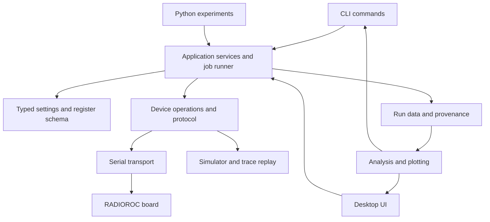

# RADIOROC desktop and CLI rebuild plan

Planning baseline: 9 September 2026. This document proposes the implementation;
the replacement application has not yet been built.

Implementation update: packaging and shared transport/board ownership are now
committed locally through `6c44092`. Read-only board status returned 5, and
cross-interface ownership contention was verified. See `IMPLEMENTATION_STATUS.md`
for current evidence and limits, and `NEXT_SESSION.md` for the next bounded task.

The target is one maintained Python package with a desktop interface and a CLI,
covering the behavior of the Windows RADIOROC application on macOS, Debian, and
Ubuntu. Reuse the working board code and measured lab results. Migrate it in
small, tested steps while retaining the existing commands.

## 1. Scope and evidence

User decisions:

- Desktop application, with a shared core for both UI and CLI.
- macOS and Linux; Debian and Ubuntu are both likely deployment environments.
- Windows machines are available for comparison with the vendor application.
- The board is connected and powered; no SiPM or pulse generator is connected.
- Use a lead agent for architecture/integration and smaller agents for bounded work.

The reference installer is `setup_Radioroc2UI_2_2_0_5.exe`. The extracted user
guide identifies itself internally as version **2.1.0.3**, dated 16 May 2025.
These are different versions. The guide is a starting inventory, not proof that
every feature in 2.2.0.5 has been captured. Audit the actual Windows application,
its embedded help, and the available extracted modules before closing scope.

Local evidence:

- `local_artifacts/generated_notes/radioroc2_user_guide.txt`: ASIC configuration,
  calibration, DAQ, FPGA routing, A7585 module, and board options.
- `local_artifacts/generated_notes/*_pydisasm.txt`: recovered behavior for the
  device, I2C, scans, ADC acquisition, and firmware options.
- `radioroc_client.py`: protocol, transport, register operations, scan engines,
  configuration/result dataclasses, snapshots, and metadata.
- `scripts/radioroc_acquire.py`: event acquisition and live spectrum workflow.
- `scripts/radioroc_standard_scurves.py`: legacy autocalibration implementation.
- `radioroc_analysis.py`, plotting scripts, presets, and dated logbooks: existing
  analysis behavior and historical hardware results to retain.

The guide says Python source is available on request. Obtaining the matching
vendor source would reduce uncertainty; that request is an optional user action,
and development can continue from the local evidence and Windows comparisons.
Keep vendor installers/extractions local as the repository already does.

Historical checks performed during planning (before implementation):

- The existing conda environment passed all **9 offline unit tests**.
- USB enumeration found `PCB_RADIOROC`, VID:PID `0403:6010`, serial `RD3_32`,
  with `/dev/cu.usbserial-RD3_320` and `/dev/cu.usbserial-RD3_321`.
- Two read-only firmware/status checks of the established control port
  `/dev/cu.usbserial-RD3_320`, including a longer timeout, received **no response**.
  No FPGA or ASIC configuration writes were issued. Device enumeration succeeded;
  FPGA communication was unconfirmed at that point. Later implementation checks
  returned status word 5; see `logbooks/2026-09-09.md`. The initial failure's
  cause remains unknown.
- Existing uncommitted source changes, presets, logs, and run data were preserved.

## 2. Architecture

The shared parent should be a package with clear modules, not a single large
controller class. The CLI and desktop UI submit the same validated operations
and consume the same results and progress events.



Proposed repository structure:

```text
pyproject.toml
src/radioroc/
  protocol/           # Frames, addresses, ADC decoding, firmware capabilities
  transport/          # Serial discovery, transport interface, simulator/replay
  device/             # FPGA/ASIC primitives, state snapshots, verified writes
  config/             # Register definitions, validation, presets, import/export
  workflows/          # S-curves, threshold/hold scans, calibration, acquisition
  application/        # Session ownership, jobs, progress, cancellation
  data/               # Durable run writer, readers, schemas, compatibility
  analysis/           # Numerical analysis and reusable plot specifications
  instruments/        # Optional A7585 and any supported instrument adapters
  cli/                # Command parsing and terminal rendering
  gui/                # Desktop views, view models, Qt worker adapter
  resources/          # Packaged default configuration and help
tests/
  unit/
  integration/        # Fake device, replay, job lifecycle, file compatibility
  gui/
  hardware/           # Explicit opt-in bench procedures
docs/
  parity/             # Feature inventory and Windows comparison evidence
  hardware/           # Wiring and validation procedures
scripts/              # Existing commands retained as compatibility wrappers
```

Recommended stack: Python, pySerial, NumPy/SciPy, a Qt desktop UI, and the
existing Matplotlib analysis where appropriate. Prefer **PySide6** for the new
UI; it is the official Qt Python binding. The current environment includes
PyQt6, so choose one binding for the new app and prove packaging before investing
in the screens. This is an architectural recommendation, supported by the
[Qt for Python documentation](https://doc.qt.io/qtforpython-6/).

Begin with one distributable project and optional dependency groups: core/CLI,
GUI, analysis, development, and optional instruments. The headless CLI must run
without Qt or a display server. Keep acquisition and numerical data independent
of plotting backends. No web server is needed for the selected desktop scope.

### Contracts to settle before agents implement features

- **One owner per board.** Serialize hardware operations through a device session.
  Add a cross-process lock keyed to board/interface identity so a CLI and GUI
  cannot operate the same board concurrently. A second process reports ownership;
  it does not silently connect. Shared concurrent control can be a later service.
- **Separate desired and observed state.** Distinguish defaults, edited settings,
  last commanded settings, and verified readback. Failed reads are errors or
  explicitly unknown values, never displayed as successfully verified defaults.
- **Typed commands.** Each workflow has validated settings, units, allowed ranges,
  firmware requirements, and structured results. Validate before opening hardware
  or creating/truncating output files. Preserve unknown imported settings for
  review or reject them explicitly; never silently discard them.
- **Explicit job lifecycle.** Idle, preparing, running, cancelling, completed,
  cancelled, failed, and disconnected states. Progress, data batches, warnings,
  and completion travel as structured events. Terminal text belongs in the CLI.
- **Cancellation and cleanup.** Check cancellation between bounded transactions
  and during ready polling. Snapshot all affected state before the first change;
  distinguish temporary scan settings from intentional configuration/calibration
  updates. On failure attempt documented cleanup; report any restoration failure
  and unknown device state. Disconnect recovery must not automatically resume DAQ.
- **Responsive UI.** A worker owns device I/O. Qt widgets run on the UI thread.
  Save all acquired samples; throttle or downsample display updates independently.
  Use bounded queues and explicit overflow/error accounting.
- **Three clear execution modes.** Dry-run validates and previews without opening
  a port; simulation produces labelled synthetic results; hardware mode performs
  real operations. Simulated data must never look like measured lab data.
- **Versioned provenance.** Record application version, dirty working-tree state
  or source fingerprint, protocol/schema version, firmware readback, board ID,
  effective configuration, channels, units, timing, run status, and cleanup outcome.

## 3. Feature parity inventory

The entries below are feature groups to expand into individual testable rows in
Phase 0. “Partial” describes reusable code, not verified Windows parity. Every
measurement/control feature must be available from the common API and CLI as
well as the GUI. Visual interactions need an equivalent API operation where
meaningful, not a literal CLI equivalent to each mouse gesture.

| ID | Feature group and required coverage | Existing foundation / gap | Validation |
|---|---|---|---|
| F01 | Connection, enumeration, device selection, board identity, firmware, reconnect, USB self-test, errors | Serial transport exists; discovery/identity and UI missing | Bare board on each OS; self-test writes require an identified safe target |
| F02 | Complete ASIC standard configuration: trigger gain/compensation; HG/LG gain and shaping; T1/T2/TQ thresholds; delay and slope; acquisition/hold sources | Selected setters exist; full named register schema missing | Windows settings-to-register comparison and readback |
| F03 | Per-channel input DAC values/enables/impedance | Needs explicit API/UI parity | Register readback; detector response later |
| F04 | Per-channel T1/T2 threshold trims; masks for T1/T2/TQ; individual/all-channel editing | T1/T2 masks and legacy trims partial | 64-channel mapping, readback, calibration comparison |
| F05 | Direct test input/Ctest selection, analog/digital probes, no-probe/reset behavior | Ctest subset exists; complete routing/probe API missing | Readback plus oscilloscope and injection |
| F06 | Raw register view/edit/read/write, binary/hex presentation; read/write all; default reset; full and masked/partial configuration import, save, drag/drop, embedded field help | CSV defaults and generic I2C primitives exist | Vendor file round-trip, reserved bits, error reporting |
| F07 | S-curves: T1/T2, selected/ignored/all channels, DAC range, clock/window, level/edge, masks, injection, stop, fitting, display/export | Scan core exists; UI/jobs/full analysis parity missing | Bare-board pedestal plus synchronized pulser |
| F08 | Automatic threshold calibration: alignment, per-channel trim update, before/after curves, reports | Present in legacy script only | Historical regression then all-channel pedestal measurements |
| F09 | Threshold/rate scans: windows, repetitions, channels, T1/T2, plots/exports | Existing core and extended analysis | Pedestal baseline; SiPM dark staircase |
| F10 | Internal/external hold scans; track-and-hold/peak sensing; sync; HG/LG statistics | Existing core and plots, limited control combinations | Pulsed signal and scope; internal code zero flagged |
| F11 | DAQ trigger logic: simple, coincidence between selected sources, N triggers in a window; local/global/external options | Low-level subset exists; full source/combination coverage unverified | Windows trace comparison and controlled trigger inputs |
| F12 | DAQ internal/external acquisition trigger and hold, conversion delay, sync, reset options, finite/continuous operation | ADC primitives and batch CLI exist; orchestration must move to core | Pedestal/forced-trigger path then signal acquisition |
| F13 | DAQ results: HG/LG channel spectra and separate HG/LG event/acquisition views, selection/visibility/clear, bins/scales, live updates, save/load/export including vendor acquisition files | Event CSV and spectrum script exist; interactive parity missing | Recorded data, known ADC vectors, signal runs |
| F14 | FPGA I/O routing, synchronization clocks/triggers, trigger indicators, validation-event control, documented signals/options | Mux and sync helpers exist; validation-event behavior needs porting | Readback; physical signal timing on scope |
| F15 | CAEN A7585 supply integration exposed by vendor UI | No shared implementation identified | Simulator then actual module and its reference software |
| F16 | Application behavior: defaults, persistent settings, help, shortcuts, plot controls, errors, cancellation | Requires Windows screen-by-screen audit | Windows walkthrough and GUI tests |
| F17 | Existing repository extras: presets, append acquisition, scan comparisons, derivative/error plots, metadata, finger-spectrum views | Already used in lab; preserve even if outside vendor scope | Existing files and logbook workflows |

For each detailed row record: vendor version/screen/control, default/range/unit,
registers/command sequence, source evidence, core method, CLI command, GUI view,
test fixture, hardware needed, owner, and status. Use separate statuses for
implemented, simulated, Windows-compared, and hardware-validated on each OS.
Investigate firmware update/bootloader and external instrument automation during
the Windows audit; if present, add them to scope. Their existence is not yet
established, and no firmware update is needed to begin this project.

## 4. Implementation milestones and acceptance gates

### M0 — Freeze the reference and make the backlog complete

1. Preserve a reviewable snapshot of the current working changes before refactoring;
   do not reset the worktree or discard local measurements.
2. Inventory the running Windows 2.2.0.5 app, including advanced panels, context
   menus, plots, file formats, help, and optional hardware pages. Compare it with
   the older guide and extracted modules. Record version and board firmware.
3. Build the detailed parity table; capture example configurations, output files,
   screenshots, and protocol traces where practical.
4. Copy selected small, non-vendor test fixtures into tracked tests. Keep large
   lab runs and vendor distributions outside source control.
5. Define the exact macOS/CPU and Debian/Ubuntu release/CPU support matrix after
   identifying the lab machines. Start packaging experiments early on those targets.
6. Resolve current board non-response: verify no competing port owner, control
   interface and driver mapping, board status/power indicators, and a known-good
   read on Windows if needed. Ask the user for physical checks when required.

**Gate:** every observed Windows feature has a backlog row; software/firmware
versions and current code/data baseline are recorded. Hardware work additionally
requires a successful status read. Offline work continues if hardware is unavailable.

### M1 — Package the core and harden communication/state handling

1. Introduce `pyproject.toml` and the package boundaries, initially moving code
   with compatibility imports/wrappers rather than changing its behavior.
2. Separate pure encoding/decoding from transport. Add explicit address, width,
   length and range checks; validate response headers as well as delimiters.
3. Replace swallowed readback errors with typed failures. Make defaults immutable
   and update observed state only from valid measurements.
4. Implement port discovery and board/interface selection, explicit timeouts,
   bounded retries, and board ownership. USB IDs alone are insufficient: this
   FTDI device exposes two interfaces and the control interface must be identified.
   The vendor uses D2XX with explicit USB transfer/latency settings. Keep the
   existing serial backend initially, then compare framing, bulk FIFO transfers,
   recovery and throughput against Windows. Add D2XX or libftdi behind the same
   interface only if demonstrated parity needs it; validate OS driver ownership
   and deployment rather than assuming the two transports are interchangeable.
5. Build a scripted fake device plus trace replay and error injection. The current
   memory transport is useful but is not a full timing/FIFO/ASIC simulator.
6. Prove CLI installation without GUI dependencies and a minimal desktop package
   launch on macOS and representative Linux environments.

**Gate:** existing public commands still work; pure/protocol regression tests pass;
dry-run needs no hardware; malformed/partial replies fail visibly; real status and
selected configuration readbacks work once the connection issue is resolved.

### M2 — Shared jobs, acquisition, calibration, and durable run files

1. Extract acquisition from `scripts/radioroc_acquire.py` into a typed workflow.
   Extract autocalibration and crossing analysis from the legacy script.
2. Move existing scans onto the common progress/cancellation/event contract.
   Define configuration changes and restoration explicitly for each operation.
3. Introduce a run writer that persists a manifest before acquisition, appends
   completed batches/points, and marks terminal status even after cancellation.
4. Preserve raw ADC integers and the existing vendor-scaled values (`raw / 4`)
   with explicit units/encoding. Verify endian order, channel order, HG/LG order,
   payload length, reported acquisition count, and count limits against Windows.
5. Distinguish physical events from per-channel rows. Preserve event/channel
   association and reject inconsistent paired arrays rather than silently truncating.
6. Make append compatibility explicit: check schema, channels, board/configuration,
   and units. Record each appended segment and its provenance; reject an
   incompatible continuation instead of overwriting the previous metadata.
7. Retain CSV/JSON compatibility; use atomic manifest updates and streamed writes.
   Add other storage formats only if measured data volume warrants them.

**Gate:** the same validated job produces equivalent command traces and results
through the API and CLI; cancellation, timeout, unplug, disk-write failure and
cleanup failure retain partial data and truthful run status. Tests verify the
expected scientific data, not just that a function returned.

### M3 — A useful desktop application through one complete workflow

Build the shell: connection status, device selection, run list, settings editor,
logs, progress/cancel, and persistent user preferences. Complete one vertical
workflow first: select a device → configure a threshold scan → preview → run →
plot live → cancel/finish → reopen saved data. Supply a simulator mode so the
whole workflow is usable with no equipment.

Settings edited on screen are visibly separate from applied/read-back settings.
Show which device and firmware are active. Saving a preset or importing a file
does not silently apply it to hardware. Expose workflow parameters with physical
units and concise explanations, plus an advanced register view.

The vendor guide describes immediate write/readback on connected edits and
applying offline edits on connection. Preserve these as explicit supported modes
alongside staged Apply/Verify, with a visible indication of which mode is active.
Record any default-behavior differences in the parity matrix; do not silently
drop these workflows under the label of UI modernization.

**Gate:** CLI and GUI submit the same configuration object; UI remains responsive;
closing a window during a run follows the defined stop/cleanup behavior; saved
results reopen with matching values and metadata. Test the packaged application.

### M4 — Complete the Windows features

Deliver vertical slices in this order: full ASIC configuration and file interchange;
S-curves/autocalibration; threshold and hold scans; full DAQ trigger combinations
and visualization; FPGA/probe diagnostics; A7585 and remaining optional controls.
Each slice includes API, CLI, UI, tests, help, and Windows comparison evidence.
Code that accepts an undocumented numeric trigger mode is not sufficient parity.

Use a shared register definition table to drive named controls, validation,
help, and register encoding. Preserve reserved bits. Probe routing must enforce
the guide's one-source restriction and support reset/no-probe; generic raw writes
must not bypass that constraint accidentally.

**Gate:** all detailed parity rows implemented and compared against Windows;
hardware-dependent rows retain explicit pending validation until the equipment
is available. Do not describe the result as complete hardware parity while any
such rows remain pending.

### M5 — Hardware comparison, performance, and releases

1. Run the staged bench matrix below, recording actual setup, firmware, commands,
   traces, data, and analysis. Establish tolerances before comparing results.
2. Require exact agreement for digital encoding, register settings and decoding;
   use documented statistical tolerances for noisy analog measurements. Never
   use one historical plot as a universal expected response.
3. Measure sustainable event throughput, loss indicators, memory growth, plotting
   load and serial latency. Run at least a one-hour representative acquisition
   with live plots and saved data; investigate any missing or duplicated samples.
4. Run automated tests on macOS and Linux; exercise both Debian and Ubuntu
   packaging. Containers can validate dependencies/headless behavior, but physical
   Linux USB access and desktop behavior need real-machine validation.
5. Produce macOS application and Linux distribution artifacts, install/uninstall
   instructions, USB permissions guidance, troubleshooting and migration notes.
   Make user configuration/data writable outside the installation directory.
6. Build/test each platform's artifact on that platform. PyInstaller is a candidate
   bundler, not a cross-compiler; see its [manual](https://pyinstaller.org/en/stable/).
   Decide signing/notarization and exact Linux package format for the release audience.

**Gate:** all agreed features pass acceptance on the declared platform matrix,
installation works on clean target machines, all required physical validations
are recorded, and existing data remains readable.

Dependencies: `M0 → M1 → M2 → M3 → M4 → M5`. Packaging experiments start in M1;
feature inventory, fixtures, UI mockups and numerical analysis can proceed in
parallel. Re-estimate the schedule after M0 and the M3 vertical slice; full parity
depends on the unresolved 2.2.0.5 surface and equipment availability.

## 5. Bench validation and when the user is needed

| Stage | Setup needed | What it establishes |
|---|---|---|
| A | No hardware | Configuration validation, protocol fixtures, recorded-data analysis, simulator workflows, CLI/UI behavior, packaging |
| B | Powered bare RADIOROC board over USB | Status/firmware, register readback, controlled configuration changes/restoration, pedestal/noise scans and calibration; forced-trigger ADC if supported and confirmed |
| C | Oscilloscope and suitable probe/cables | Actual FPGA routing, sync clocks/pulses, analog/digital probes and timing; register readback alone cannot establish signal correctness |
| D | Pulse generator, appropriate attenuation/injection path and scope | Signal S-curves, internal/external hold, peak sensing, HG/LG response; suitable independent inputs for coincidence/window trigger tests; external clock versus synchro-trigger routing checked separately |
| E | Known SiPM, its appropriate bias supply, dark enclosure | Dark threshold staircase, finger spectra/gain, realistic detector acquisition and input-DAC effects |
| F | Actual CAEN A7585, if required for vendor parity | Supply discovery/configuration/readback and supported output behavior using module-specific procedures |
| G | Windows reference machine and target Linux machine(s) | Controlled Windows comparisons and physical USB/driver behavior on Debian/Ubuntu |

Nothing needs to be connected for software architecture, simulation, packaging,
or recorded-data work. No SiPM or pulse generator is needed to resolve the current
status-read failure. First ask for power/status/cable/port-owner checks if software
diagnostics cannot explain it; do not assume “connected” proves FPGA operation.

Before each equipment-dependent test, provide the user a short test card:
purpose, required equipment, exact connectors/routing, verified signal and bias
settings, command/job, expected observation, and stop/cleanup procedure. The
old IO1 mux-5/in-test1 setup in `SMOKE_TESTS.md` is historical guidance and must be
checked against the current wiring and board revision. Never treat old SiPM or
generator values as universally appropriate settings for new equipment.

If an item is unavailable, continue the corresponding software work with
simulation/replay and record physical validation as pending. Preserve A7585 in
scope even if absent; do not substitute a simulated test for its release validation.

## 6. Agent execution plan

Use one lead and up to three workers at a time, matching the four concurrent
slots available in this session. During this planning pass two GPT-5.6 Luna
workers audited vendor coverage and Python reuse; the lead reviewed their findings.

| Role | Suggested model / scope | Responsibilities |
|---|---|---|
| Lead | Current capable model | Architecture, contracts, uncertain protocol reasoning, physical test coordination, integration and release judgment |
| Inventory/documentation worker | GPT-5.6 Luna | Bounded feature extraction, help text, fixture catalogues, migration documentation |
| Implementation worker | GPT-5.6 Terra or Sol; Luna for simple wrappers | One defined module/screen/CLI adapter with agreed interfaces and acceptance checks |
| Reviewer/test worker | Terra/Sol for routine integration; stronger reasoning for protocol/state/DAQ | Independent defect review, fault cases, numerical correctness and parity evidence |

Subagents can use different models and reasoning levels. Smaller models suit
clear bounded tasks, but parallel agents can consume **more total tokens**.
Control cost through small context packets, concise results and few workers;
do not assume that a cheaper model inherently uses fewer tokens. This follows
the [official subagent guidance](https://learn.chatgpt.com/docs/agent-configuration/subagents).

Each task packet contains: objective, allowed files, API contract, relevant
feature IDs/evidence, acceptance tests, known constraints, and the expected
change summary. Avoid passing the entire conversation or vendor archive to every
worker. Stop at the task boundary and return evidence; escalate ambiguity to
the lead before inventing hardware behavior.

Use isolated worktrees based on the same preserved baseline for implementation,
or strict non-overlapping file ownership where worktrees are unavailable. Only
the lead integrates changes and updates shared contracts. Workers use fake or
replayed devices. **Only one designated operator accesses the physical board**;
no concurrent agent scans, no speculative protocol writes, and no worker changes
to the active lab setup. A reviewed feature slice is the merge unit.

Useful initial tasks after the plan:

1. Lead: resolve the read-only connection issue and define protocol/state contracts.
2. Inventory worker: expand F01–F17 against the Windows 2.2.0.5 application.
3. Fixture worker: catalogue representative existing runs and expected decoding.
4. Packaging worker: prove minimal CLI/desktop installation on agreed targets.

The first deliverable should be the preserved baseline, a complete feature
matrix, a small installable package, and one tested CLI/UI workflow. That creates
the foundation for every remaining feature without interrupting current lab tools.

## 7. Implementation kickoff and Git workflow

Start with a small baseline milestone. The current lab baseline has now been
committed on `chore/lab-baseline` and tagged `pre-desktop-rebuild` at `603c69b`.
The initial packaging and development checks are implemented on
`build/python-foundation`; shared transport/ownership follows on
`feat/transport-ownership` at `6c44092`. See `IMPLEMENTATION_STATUS.md` for
validation limits and the next bounded tasks.

The initial Git audit found `main` at `b77f76d`, seven modified tracked files,
untracked acquisition/plotting tools, a preset, lab notes/figures, this plan, and
five measurement directories (`test0`, `test1`, `test1_std`, `test2`, `test3`).
Existing vendor files and `radioroc_runs` are ignored.

Correction to cleanup: the user intended those five experiment directories to
remain local and uncommitted. They were deleted before that clarification, then
27 files were recovered from local Git snapshot tree
`9c1da1e65fe2384f39c680f5b29add8ca341d2b6` and verified against its blob hashes.
Narrow Git exclusions keep the restored directories out of commits. Scripts,
logbooks and their figures, results under `radioroc_runs`, and automated tests
were retained. Snapshot recovery verifies the recovered bytes, not that no
unrecorded changes existed after that snapshot.

### Delivery 0 — Preserve the current lab baseline

- Review all pending source changes and new scripts together for dependencies.
  Checkpoint coherent groups: acquisition/scan/analysis work with its tests and
  presets; lab notes with referenced figures; rebuild planning documents.
- Inventory the retained results under `radioroc_runs` and select small documented
  fixtures for regression tests where useful. Keep those results locally and
  record their backup location; Git does not back up ignored data. Exclude the
  five local experiment directory names listed above from commits, without
  treating exclusion as permission to delete. Do not ignore every CSV or every
  `test*` path.
- Run offline tests and CLI import/help checks using `.conda-radioroc` and record
  results. Label the baseline as a source checkpoint, with hardware communication
  unverified until the status check succeeds.
- Create a baseline branch and reviewable commits; after integration, tag the
  exact preserved baseline, for example `pre-desktop-rebuild`. Inspect the remote
  state before integrating or pushing; the audit only checked locally cached refs.

Done when: intended source/docs are committed, data is accounted for, Git status
is clean through intentional tracking/ignore choices, and the baseline is
recoverable. No deletion or history rewrite is needed for this milestone.

### Delivery 1 — Reproducible development setup

- Add a minimal installable package definition with explicit dependencies and
  Python support, retaining existing commands and imports.
- Add automated offline checks for macOS and Linux. Keep hardware tests opt-in.
- Document development commands and contribution rules; add concise repository
  agent instructions for file ownership, environments and hardware coordination.
- Turn feature IDs into a tracked backlog with acceptance criteria and evidence.

Done when: a fresh development environment can install and run the offline checks
without the vendor installer, a display server, or a connected board.

### Deliveries 2–5 — Small implementation slices

| Delivery | Bounded scope | Completion evidence |
|---|---|---|
| 2 | Extract protocol and transport; identify the board and enforce exclusive access | Existing frame behavior preserved; partial replies, disconnects and ownership conflicts tested |
| 3 | Shared job lifecycle, progress/cancellation and durable results for one threshold workflow | API and CLI use the same operation; interrupted runs retain truthful partial results |
| 4 | Desktop shell and threshold workflow using simulation, then hardware | Configure/run/cancel/plot/reopen works through the shared core |
| 5 onward | One parity group per feature slice | API, CLI, UI, documentation and relevant validation delivered together |

Connection diagnosis and Windows inventory can proceed alongside offline
implementation. Successful hardware checks are required only for the delivery
claims that depend on them. Existing nine tests are a starting baseline, not
adequate coverage for all new behavior.

### Working rhythm

Keep `main` usable. Use short-lived branches and pull requests per delivery or
smaller coherent feature; a permanent `develop` branch is unnecessary initially.
Retain legacy entry points until their replacements have comparison evidence.

Before each implementation session, choose one backlog item, its inputs, allowed
files and completion criteria. At the end, record the commit/PR, checks run,
remaining limitations and next item. Persist this in the repository so a new
session can resume without relying on the conversation history.

Delegate only independent tasks once interfaces are agreed. Workers use separate
worktrees or non-overlapping files; the lead reviews and integrates. Shared
protocol, configuration and job contracts should have one editor at a time.
