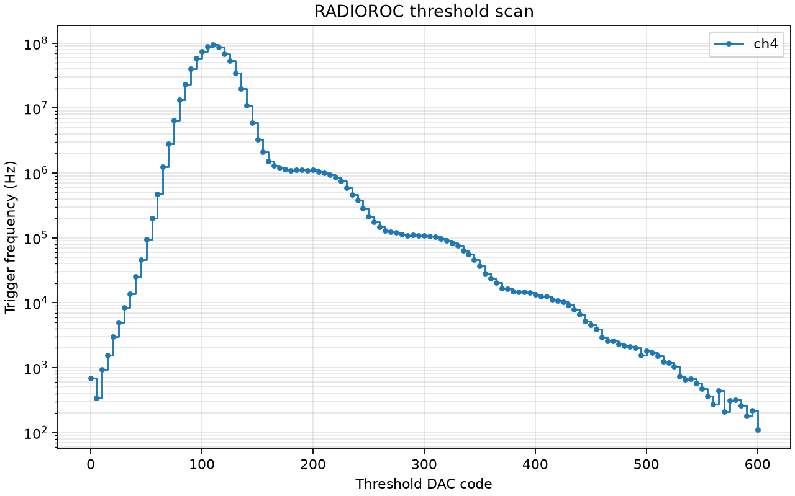

# 2026-06-26

- Implemented a threshold-scan mode matching the user guide workflow after S-curves/autocalibration.
- Added `--threshold-scan` and `--trigger-window-ms` to `scripts/radioroc_standard_scurves.py`.
- Threshold scan sweeps the T1/T2 threshold DAC, optionally masks to the selected channel, counts triggers over a fixed time window, reads the 32-bit trigger counter from FPGA address 96, and writes trigger frequency in Hz to CSV.
- Added `scripts/plot_threshold_scan.py` to plot threshold-scan CSV files to PNG using matplotlib.
- Confirmed the conda environment has matplotlib and numpy installed. Set the plotting script's matplotlib config directory to `/tmp/radioroc-matplotlib` to avoid non-writable home-cache warnings.
- Restored and verified the default I2C table before channel-4 tests: 677 rows checked, 677 matched, 0 mismatches.
- Channel 4 default pedestal S-curve crossed between DAC 110 and 120.
- Channel 4 threshold scan without powered SiPM produced a visible pedestal-noise trigger-rate curve from roughly DAC 95 to 130, peaking near DAC 105-110.
- Added `--trigger-preamp-gain` / `--pat-gain` scan option for selected channels. This writes the trigger preamplifier paT gain field at `subadd 1`, bits `[5:0]`, preserving the compensation bits `[7:6]`. Code `1` is maximum gain and `63` is minimum gain; code `0` is rejected because the vendor help says it opens/unbiases the preamplifier.
- Verified input impedance mapping from the vendor UI: `subadd 6`, bit 7, where `1` selects 100 ohm input and `0` selects HiZ input requiring an external resistor.
- Verified live channel 4 input impedance was set to 100 ohm before SiPM scans.
- Updated `scripts/plot_threshold_scan.py` so running it with no CSV argument automatically plots the newest `thresholdscan.csv` under `radioroc_runs`.
- Added `--threshold-averages` to average repeated threshold-count windows per DAC/channel, and `--steps` plotting to display threshold scans as staircase plots without straight-line interpolation.
- Compared the Python threshold-scan result against the Windows EXE. The key fix was matching settings rather than changing the acquisition implementation: defaults loaded, 100 ohm input, SiPM connected and dark, `paT` gain code 1, DAC range 0-600, and DAC step 5.
- Final channel-4 SiPM dark staircase command:

```bash
/Users/tengiz/weeroc/.conda-radioroc/bin/python scripts/radioroc_standard_scurves.py \
  --execute \
  --apply-defaults \
  --threshold-scan \
  --channels 4 \
  --pat-gain 1 \
  --dac-min 0 \
  --dac-max 600 \
  --dac-step 5 \
  --trigger-window-ms 100 \
  --threshold-averages 1 \
  --out-dir radioroc_runs/staircase_ch4_gain1_compare_exe_20260626
```



