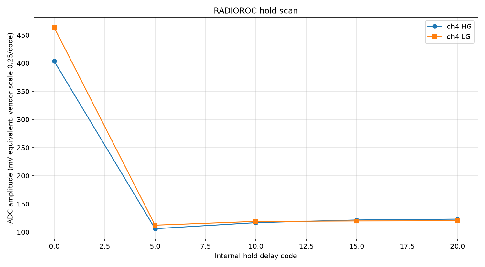
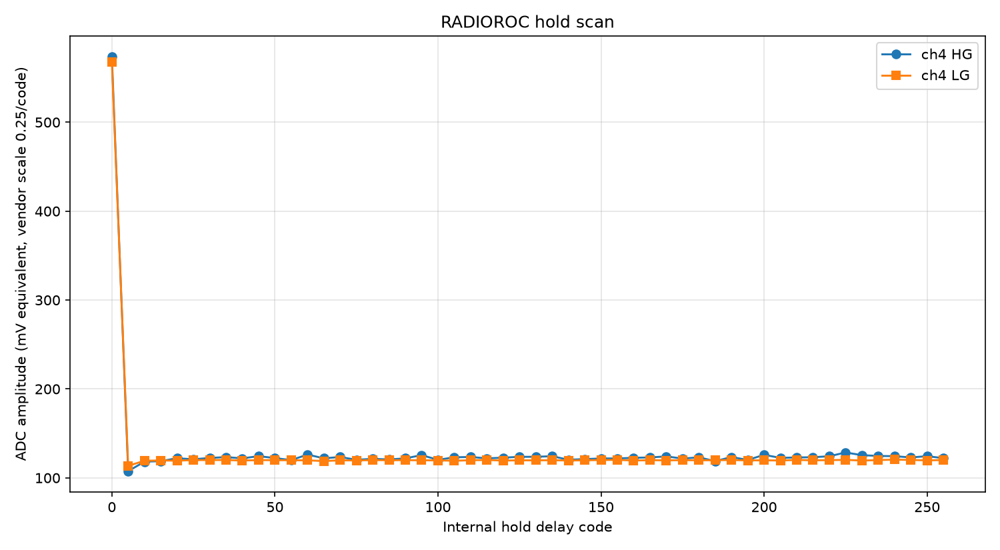
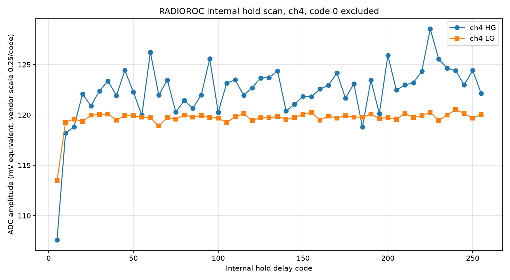
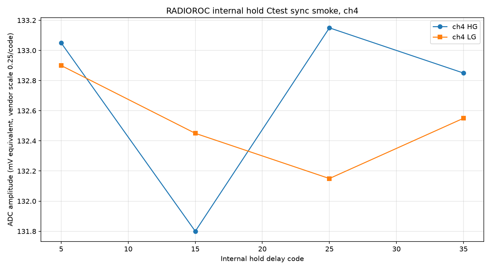
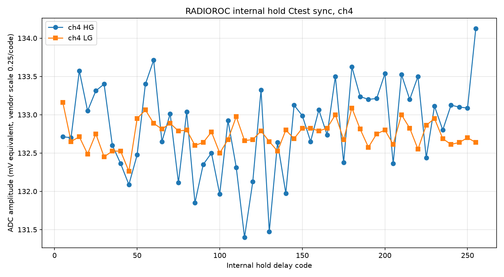
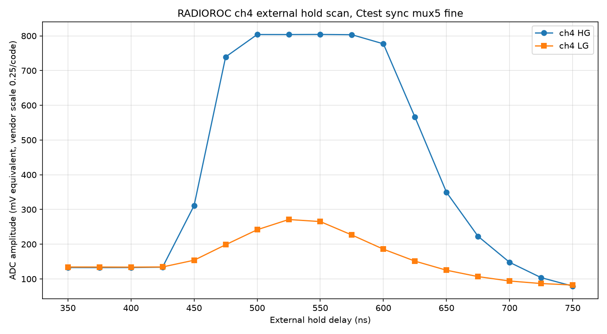

# 2026-06-26

- Implemented a threshold-scan mode matching the user guide workflow after S-curves/autocalibration.
- Added `--threshold-scan` and `--trigger-window-ms` to `scripts/radioroc_standard_scurves.py`.
- Threshold scan sweeps the T1/T2 threshold DAC, optionally masks to the selected channel, counts triggers over a fixed time window, reads the 32-bit trigger counter from FPGA address 96, and writes trigger frequency in Hz to CSV.
- Added `scripts/plot_threshold_scan.py` to plot threshold-scan CSV files to PNG using matplotlib.
- Confirmed the conda environment has matplotlib and numpy installed. Set the plotting script's matplotlib config directory to `/tmp/radioroc-matplotlib` to avoid non-writable home-cache warnings.
- Restored and verified the default I2C table before channel-4 tests: 677 rows checked, 677 matched, 0 mismatches.
- Channel 4 default pedestal S-curve crossed between DAC 110 and 120.
- Channel 4 threshold scan without powered SiPM produced a visible pedestal-noise trigger-rate curve from roughly DAC 95 to 130, peaking near DAC 105-110.
- Added `--trigger-preamp-gain` / `--pat-gain` scan option for selected channels. This writes the trigger preamplifier paT gain field at `subadd 1`, bits `[5:0]`, preserving the compensation bits `[7:6]`. Code `1` is maximum gain and `63` is minimum gain; code `0` is rejected because the vendor help says it opens/unbiases the preamplifier.
- Verified input impedance mapping from the vendor UI: `subadd 6`, bit 7, where `1` selects 100 ohm input and `0` selects HiZ input requiring an external resistor.
- Verified live channel 4 input impedance was set to 100 ohm before SiPM scans.
- Updated `scripts/plot_threshold_scan.py` so running it with no CSV argument automatically plots the newest `thresholdscan.csv` under `radioroc_runs`.
- Added `--threshold-averages` to average repeated threshold-count windows per DAC/channel, and `--steps` plotting to display threshold scans as staircase plots without straight-line interpolation.
- Compared the Python threshold-scan result against the Windows EXE. The key fix was matching settings rather than changing the acquisition implementation: defaults loaded, 100 ohm input, SiPM connected and dark, `paT` gain code 1, DAC range 0-600, and DAC step 5.
- Final channel-4 SiPM dark staircase command:

```bash
/Users/tengiz/weeroc/.conda-radioroc/bin/python scripts/radioroc_standard_scurves.py \
  --execute \
  --apply-defaults \
  --threshold-scan \
  --channels 4 \
  --pat-gain 1 \
  --dac-min 0 \
  --dac-max 600 \
  --dac-step 5 \
  --trigger-window-ms 100 \
  --threshold-averages 1 \
  --out-dir radioroc_runs/staircase_ch4_gain1_compare_exe_20260626
```


## Hold Scan Prototype

- Added experimental external-hold scan mode to `scripts/radioroc_standard_scurves.py`.
- The implementation follows the vendor ADC DAQ setup path: set ASIC external-hold mode, encode FPGA external hold delay in 5 ns units, trigger ADC acquisition batches, read ADC frames from FPGA address `20`, and decode high-gain/low-gain channel values with the vendor `0.25` scale.
- Added `scripts/plot_hold_scan.py`, which defaults to the newest `holdscan.csv` under `radioroc_runs`.
- Ran a channel-4 smoke scan with defaults applied, `paT` gain code 1, threshold DAC 250, hold delays 0/50/100 ns, and 1 ADC acquisition per point. The ADC acquisition path completed without timeout and returned channel-4 HG/LG means:
  - 0 ns: HG 111.5, LG 112.0
  - 50 ns: HG 130.25, LG 114.0
  - 100 ns: HG 109.25, LG 111.5

## Internal Hold Scan

- Disassembled the vendor `holdscan.pyc` and mapped the internal ASIC hold scan:
  - Hold mode control: ASIC register `add=65, subadd=12`, vendor writes bits `[2:4]` to `10` for internal hold.
  - Hold delay code: ASIC register `add=65, subadd=8`, written as an 8-bit code.
  - Vendor ADC setup for internal hold writes FPGA word `25 = 01110100`, word `31 = 11111111`, and uses FPGA address `20` ADC frame readout.
- Updated `scripts/radioroc_standard_scurves.py` so `--hold-scan` defaults to `--hold-mode internal`; external FPGA hold remains available with `--hold-mode external`.
- A short internal hold scan with `--apply-defaults` timed out while rewriting the full default I2C table, before reaching hold-scan execution.
- Retried without rewriting defaults and confirmed the internal hold path works on channel 4 with `paT` gain code 1, threshold DAC 250, hold codes 0/5/10/15/20, and 1 ADC acquisition per point:
  - code 0: HG 403.25, LG 463.25
  - code 5: HG 106.0, LG 112.25
  - code 10: HG 116.75, LG 119.0
  - code 15: HG 121.5, LG 119.75
  - code 20: HG 123.0, LG 120.0



- Ran a fuller channel-4 internal hold scan over hold codes `0..255` in steps of `5`, with 10 ADC acquisitions per point, no full default rewrite:
  - Output: `radioroc_runs/hold_internal_ch4_full_20260626/holdscan.csv`
  - Code 0 was a large outlier: HG 573.7, LG 567.7.
  - Excluding code 0, max HG was at code 225: HG 128.55, LG 120.275.
  - Excluding code 0, max LG was at code 240: HG 124.4, LG 120.525.
  - Excluding code 0, mean response was HG 122.36, LG 119.67.



- Interpreted hold code 0 as an invalid/edge-case internal delay-cell point rather than a useful timing value. The value is rail-like and very stable, and the user guide notes that the first internal-hold values can be invalid or incoherent in peak-sensing mode.
- Updated `scripts/plot_hold_scan.py` with `--exclude-zero` and `--x-min` so standard diagnostic plots can remove invalid early hold-code points.
- Added a channel-4 full internal hold plot with code 0 excluded. This shows the useful region more clearly: after code 5 the LG curve is mostly flat near 119-120, while HG has more scatter and no strong clean peak under the current dark-SiPM conditions.



## Synchronized Ctest Injection

- Added `--hold-synchro-trigger` to `scripts/radioroc_standard_scurves.py`.
- The option mirrors the vendor external holdscan behavior by toggling the FPGA synchro bit in word `22` after arming each ADC batch. This is intended to drive the generator external-trigger input from the board, with generator output connected through attenuation to `in-test1`.
- Ran a short synchronized Ctest smoke scan on channel 4 with generator trigger connected to board `IO1`, Ctest enabled, internal hold mode, `paT` gain code 1, threshold DAC 250, hold codes 5/15/25/35, and 5 ADC acquisitions per point:
  - code 5: HG 133.05, LG 132.9
  - code 15: HG 131.8, LG 132.45
  - code 25: HG 133.15, LG 132.15
  - code 35: HG 132.85, LG 132.55
- All four points returned 5/5 acquisitions without timeout. The synchronized Ctest response is above the prior dark-SiPM plateau, indicating the FPGA sync pulse and Ctest routing are functioning.



- Ran the full synchronized Ctest internal hold scan on channel 4:

```bash
/Users/tengiz/weeroc/.conda-radioroc/bin/python scripts/radioroc_standard_scurves.py \
  --execute \
  --hold-scan \
  --hold-mode internal \
  --channels 4 \
  --hold-trigger-channel 4 \
  --hold-threshold-dac 250 \
  --hold-min-code 5 \
  --hold-max-code 255 \
  --hold-step-code 5 \
  --hold-acquisitions 20 \
  --hold-timeout-s 8 \
  --pat-gain 1 \
  --use-ctest \
  --hold-synchro-trigger \
  --out-dir radioroc_runs/hold_internal_ch4_ctest_sync_full_20260626
```

- All 51 hold-code points returned 20/20 acquisitions.
- HG response: min 131.4, max 134.125, mean 132.84, stdev 0.59.
- LG response: min 132.2625, max 133.1625, mean 132.74, stdev 0.18.
- The synchronized injected-signal hold scan is very flat across hold codes 5-255. Under this Ctest pulse and internal peak-sensing configuration, the measurement does not show a sharp timing peak; it mainly confirms stable synchronized injected acquisition. Further timing discrimination likely needs a different pulse mode/amplitude/trigger condition or external hold/track-and-hold configuration.



## External Hold Scan With Confirmed Ctest Synchronization

- Diagnosed the FPGA synchro output routing using the new IO mux scan. The connector being used showed clear sync pulses when the FPGA IO mux index was `5`.
- Verified on the oscilloscope that both the RADIOROC IO sync pulse and the attenuated generator pulse were present before repeating the scan.
- Internal ASIC hold scans with confirmed sync and Ctest injection remained essentially flat, so the useful manual workflow is the external-hold scan described around the synchro-trigger hold-scan figures.
- Ran a coarse external-hold scan on channel 4 with `IO1` mux index `5`, Ctest enabled, `paT` gain code 1, threshold DAC 250, 30 acquisitions per point, and 400 ns conversion delay. This produced the first strong timing-dependent injected response:
  - Baseline before 400 ns: HG/LG near 133-135 ADC units.
  - Large HG response at 500-600 ns: HG about 754-803 ADC units.
  - LG response peaked lower, around 184-241 ADC units in the same region.
- Ran a finer external-hold scan over `350..750 ns` in 25 ns steps with 50 acquisitions per point:

```bash
/Users/tengiz/weeroc/.conda-radioroc/bin/python scripts/radioroc_standard_scurves.py \
  --execute \
  --hold-scan \
  --hold-mode external \
  --channels 4 \
  --hold-trigger-channel 4 \
  --hold-threshold-dac 250 \
  --hold-min-ns 350 \
  --hold-max-ns 750 \
  --hold-step-ns 25 \
  --hold-acquisitions 50 \
  --hold-conversion-delay-ns 400 \
  --pat-gain 1 \
  --use-ctest \
  --hold-synchro-trigger \
  --sync-io io1 \
  --sync-io-mux-index 5 \
  --adc-rstn-manual \
  --out-dir radioroc_runs/hold_external_ch4_ctest_sync_mux5_fine_20260626
```

- Fine-scan result:
  - Baseline: about 133 ADC units before 425 ns.
  - Leading edge: starts around 450-475 ns.
  - HG plateau: about 804 ADC units from 500-575 ns.
  - Falling edge: begins after roughly 600 ns.
  - A practical external hold setting for this injected test is around 525 ns or 550 ns.
- This is the first meaningful hold-scan result with controlled Ctest injection. The next hold-scan work should build from external hold mode with `--sync-io-mux-index 5`.


