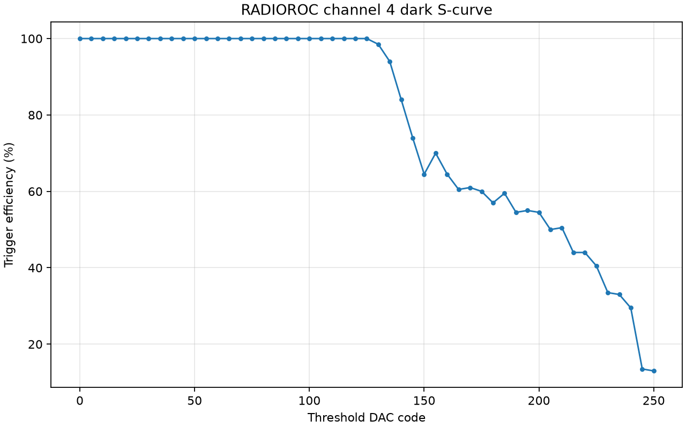
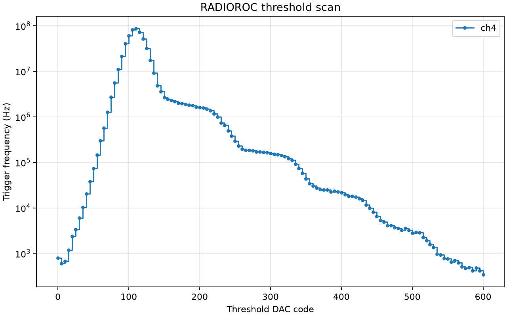
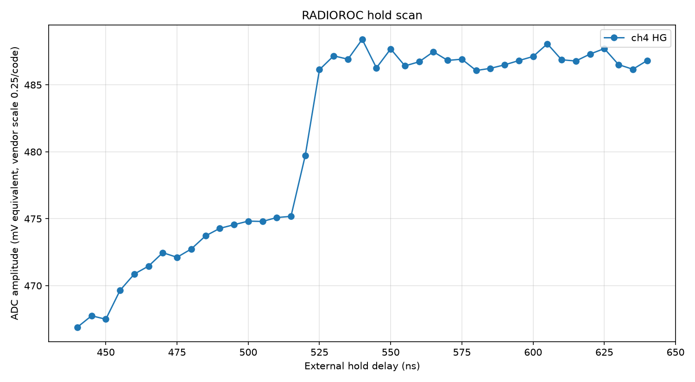
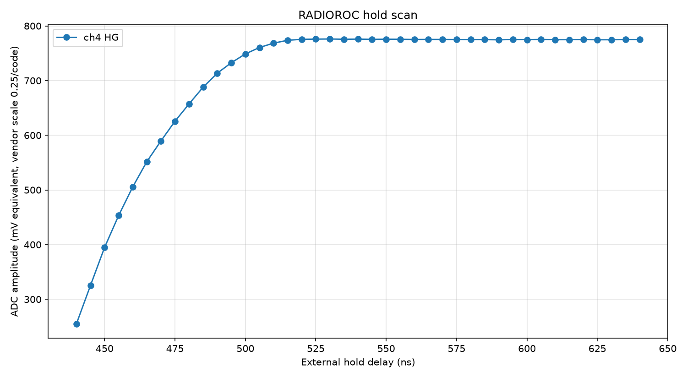

# 2026-06-29

## Refactor Into Library And Thin Tools

- Added `radioroc_client.py` as the reusable hardware library.
- Added typed config/result dataclasses for S-curve, threshold scan, hold scan,
  sync pulse, and IO mux scan workflows.
- Added `RadiorocDevice` for FPGA word access, ASIC I2C FIFO operations,
  default config apply/verify, trigger mask setup, Ctest setup, threshold DAC
  setup, ADC acquisition, external/internal hold setup, sync pulse output, and
  IO mux control.
- Added `RadiorocMemoryTransport` for non-hardware tests.
- Kept `scripts/radioroc_standard_scurves.py` as a legacy compatibility and
  reference script while new user-facing scripts take over daily workflows.

## User-Facing Scripts

- Added focused commands:
  - `scripts/radioroc_check_connection.py`
  - `scripts/radioroc_apply_defaults.py`
  - `scripts/radioroc_threshold_scan.py`
  - `scripts/radioroc_scurve.py`
  - `scripts/radioroc_hold_scan.py`
  - `scripts/radioroc_sync_pulse.py`
  - `scripts/radioroc_io_mux_scan.py`
- Added `scripts/radioroc_cli_common.py` for shared serial args, write-safety
  args, preset loading, metadata creation, and board preparation.
- Added JSON presets under `configs/presets/`.

## Plotting And Analysis

- Added `radioroc_analysis.py` for:
  - threshold and hold CSV parsing
  - latest-run discovery
  - threshold scan peak/staircase summaries
  - hold scan peak/plateau summaries
  - internal hold code-zero outlier detection
  - threshold, hold, and hold-comparison plotting
- Reworked `scripts/plot_threshold_scan.py` and `scripts/plot_hold_scan.py` as
  thin wrappers.
- Added `scripts/plot_hold_comparison.py`.

## Tests

- Added `tests/test_radioroc_core.py`.
- Covered bit parsing, serial frame encoding, channel parsing, scan range
  validation, scan config validation, CSV parsing, latest-run discovery,
  threshold/hold summaries, and memory transport behavior.
- Verified:

```bash
/Users/tengiz/weeroc/.conda-radioroc/bin/python -m py_compile radioroc_client.py radioroc_analysis.py scripts/*.py tests/*.py
/Users/tengiz/weeroc/.conda-radioroc/bin/python -m unittest discover -s tests -v
```

## Live Hardware Smoke Tests

- Read-only status check passed:

```text
OK: address 100 = 00000101 (5)
```

- Sync pulse test through `scripts/radioroc_sync_pulse.py` worked on FPGA
  `IO1`, mux index `5`.
- IO mux scan through `scripts/radioroc_io_mux_scan.py` confirmed mux index `5`
  as the useful sync output. Indices `1` and `7` produced slow, seconds-long
  pulses and were rejected as candidates.

## Short External Ctest Hold Scan

- Ran:

```bash
/Users/tengiz/weeroc/.conda-radioroc/bin/python scripts/radioroc_hold_scan.py \
  --execute \
  --preset configs/presets/hold_external_track_ctest_ch4.json \
  --hold-min 450 \
  --hold-max 560 \
  --hold-step 25 \
  --acquisitions 10 \
  --out-dir radioroc_runs/live_test_external_hold_ch4_short
```

- Result:

```text
450 ns: HG 508.7
475 ns: HG 801.025
500 ns: HG 802.2
525 ns: HG 801.15
550 ns: HG 802.0
```

- Plot summary:

```text
ch4 HG: peak=802.2 at 500.0; plateau=475.0..550.0
```

- Files:
  - `radioroc_runs/live_test_external_hold_ch4_short/holdscan.csv`
  - `radioroc_runs/live_test_external_hold_ch4_short/metadata.json`
  - `radioroc_runs/live_test_external_hold_ch4_short/holdscan.png`

## Short SiPM Threshold Scan

- SiPM was biased and connected for this test.
- Ran:

```bash
/Users/tengiz/weeroc/.conda-radioroc/bin/python scripts/radioroc_threshold_scan.py \
  --execute \
  --preset configs/presets/threshold_ch4_sipm_dark.json \
  --dac-min 0 \
  --dac-max 100 \
  --dac-step 10 \
  --out-dir radioroc_runs/live_test_threshold_ch4_short
```

- Result:

```text
DAC 0:   610 Hz
DAC 10:  1,270 Hz
DAC 20:  4,300 Hz
DAC 30:  10,300 Hz
DAC 40:  32,920 Hz
DAC 50:  109,180 Hz
DAC 60:  405,720 Hz
DAC 70:  1,634,860 Hz
DAC 80:  6,542,530 Hz
DAC 90:  26,264,530 Hz
DAC 100: 67,127,210 Hz
```

- Plot summary:

```text
ch4: peak=67127210.0 Hz at DAC 100.0; first_nonzero=0.0; last_above_1khz=100.0
```

- Files:
  - `radioroc_runs/live_test_threshold_ch4_short/thresholdscan.csv`
  - `radioroc_runs/live_test_threshold_ch4_short/metadata.json`
  - `radioroc_runs/live_test_threshold_ch4_short/thresholdscan.png`

## Channel 4 Dark Science Baseline

- SiPM was biased. No source was intentionally placed for these baseline runs.
- Ran channel-4 dark S-curve:

```bash
/Users/tengiz/weeroc/.conda-radioroc/bin/python scripts/radioroc_scurve.py \
  --execute \
  --apply-defaults \
  --channels 4 \
  --dac-min 0 \
  --dac-max 250 \
  --dac-step 5 \
  --pat-gain 1 \
  --out-dir radioroc_runs/science_ch4_dark_scurve_20260629
```

- Observation:
  - Efficiency stayed at 100% through about DAC 125.
  - It rolled down afterward, reaching about 50% around DAC 205-210.
  - It remained about 13% at DAC 250, so a wider scan would be useful if the
    full falling edge is needed.
- Files:
  - `radioroc_runs/science_ch4_dark_scurve_20260629/scurve.csv`
  - `radioroc_runs/science_ch4_dark_scurve_20260629/metadata.json`
  - `radioroc_runs/science_ch4_dark_scurve_20260629/scurve.png`



## Channel 4 Dark Threshold Science Scan

- Ran channel-4 dark threshold scan:

```bash
/Users/tengiz/weeroc/.conda-radioroc/bin/python scripts/radioroc_threshold_scan.py \
  --execute \
  --preset configs/presets/threshold_ch4_sipm_dark.json \
  --dac-min 0 \
  --dac-max 600 \
  --dac-step 5 \
  --window-ms 100 \
  --averages 1 \
  --out-dir radioroc_runs/science_ch4_dark_threshold_20260629
```

- Observation:
  - Peak rate was `86,768,000 Hz` at DAC `110`.
  - Rate fell to about `996,330 Hz` at DAC `225`.
  - Rate fell below `1000 Hz` after about DAC `530`.
  - This is a usable dark threshold/staircase baseline for selecting a source
    acquisition threshold.
- Files:
  - `radioroc_runs/science_ch4_dark_threshold_20260629/thresholdscan.csv`
  - `radioroc_runs/science_ch4_dark_threshold_20260629/metadata.json`
  - `radioroc_runs/science_ch4_dark_threshold_20260629/thresholdscan.png`



## Channel 4 External Ctest Hold Science Scan

- Ran external track-and-hold Ctest timing scan:

```bash
/Users/tengiz/weeroc/.conda-radioroc/bin/python scripts/radioroc_hold_scan.py \
  --execute \
  --preset configs/presets/hold_external_track_ctest_ch4.json \
  --hold-min 440 \
  --hold-max 640 \
  --hold-step 5 \
  --acquisitions 50 \
  --out-dir radioroc_runs/science_ch4_ctest_hold_track_20260629
```

- Observation:
  - HG was much flatter than the earlier strong Ctest timing scan.
  - HG was about `467..488` ADC units over `440..640 ns`.
  - The plot helper reported peak `488.4` at `540 ns`, but the 90% plateau
    covered the full scanned range.
  - This does not reproduce the earlier `~800` ADC plateau. Before treating it
    as final timing data, re-check generator output amplitude/burst settings and
    the attenuated Ctest input at the board.
- Files:
  - `radioroc_runs/science_ch4_ctest_hold_track_20260629/holdscan.csv`
  - `radioroc_runs/science_ch4_ctest_hold_track_20260629/metadata.json`
  - `radioroc_runs/science_ch4_ctest_hold_track_20260629/holdscan.png`



## Channel 4 External Ctest Hold Scan With SiPM Bias Off

- The preceding Ctest hold scan was repeated after turning the SiPM bias off.
- This tested the hypothesis that the biased SiPM dark triggers were polluting
  the synchronized Ctest acquisition at threshold DAC 250.
- Ran:

```bash
/Users/tengiz/weeroc/.conda-radioroc/bin/python scripts/radioroc_hold_scan.py \
  --execute \
  --preset configs/presets/hold_external_track_ctest_ch4.json \
  --hold-min 440 \
  --hold-max 640 \
  --hold-step 5 \
  --acquisitions 50 \
  --out-dir radioroc_runs/science_ch4_ctest_hold_track_biasoff_20260629
```

- Observation:
  - All points returned exactly `50` acquisitions, as requested.
  - The Ctest timing shape returned.
  - HG rose from about `255` at 440 ns to a plateau near `775`.
  - Plot helper summary: peak `776.125` at `530 ns`, 90% plateau
    `490..640 ns`.
  - The comparison confirms that the weird biased-SiPM hold scan was
    contaminated by SiPM dark triggers, not a refactor regression.
- Files:
  - `radioroc_runs/science_ch4_ctest_hold_track_biasoff_20260629/holdscan.csv`
  - `radioroc_runs/science_ch4_ctest_hold_track_biasoff_20260629/metadata.json`
  - `radioroc_runs/science_ch4_ctest_hold_track_biasoff_20260629/holdscan.png`


