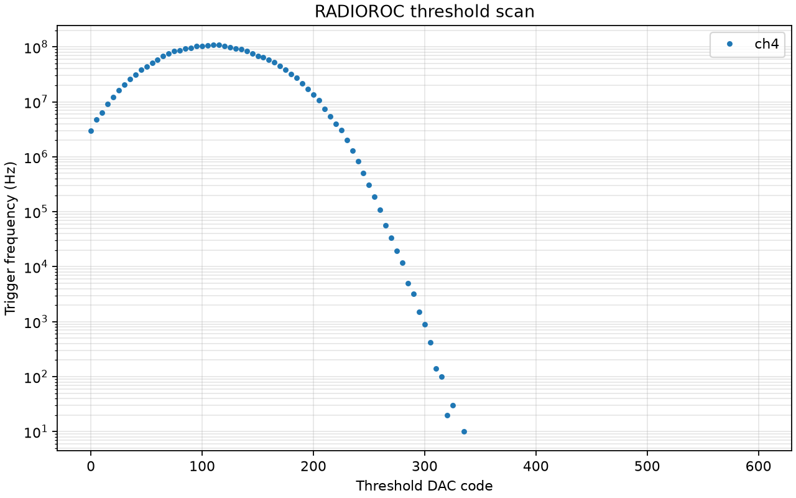
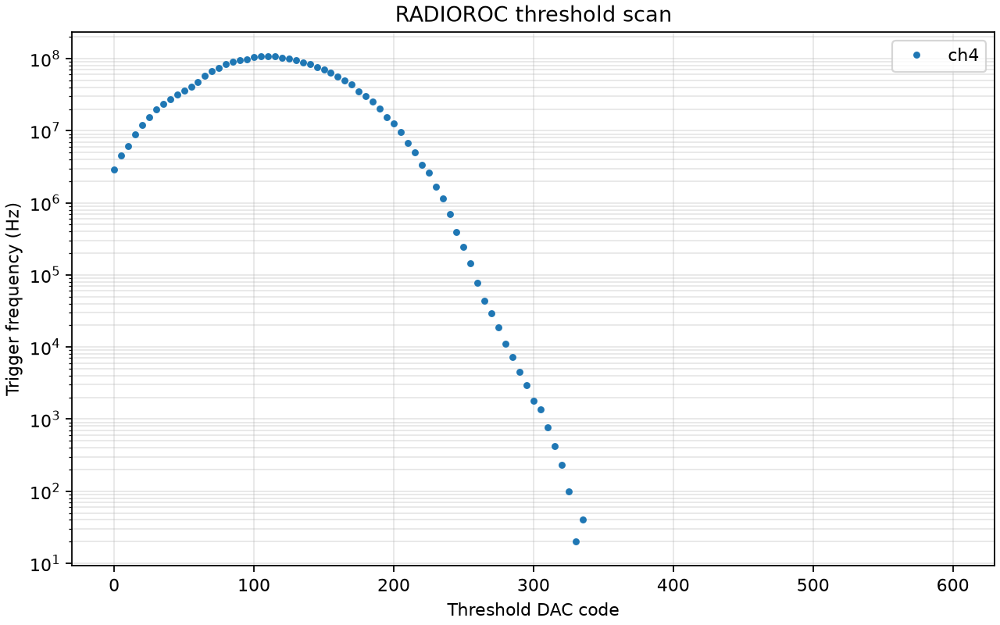
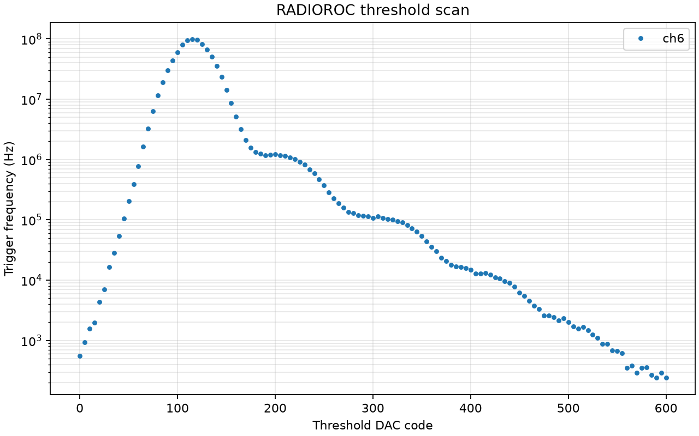
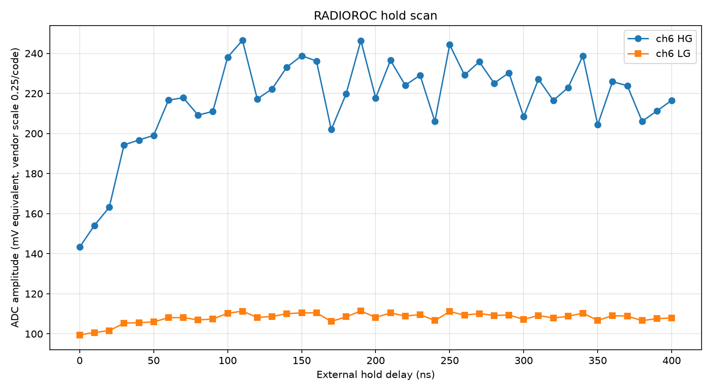
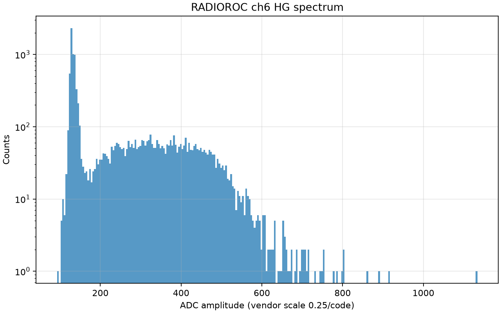
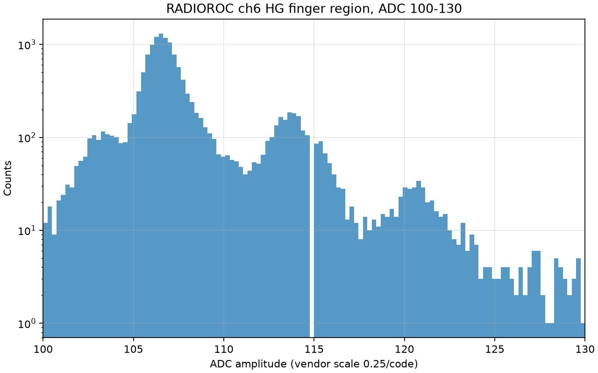

# 2026-07-02

## SiPM Comparison And Finger-Plot Candidate

- Goal: quickly characterize a new SiPM and try to obtain a SiPM finger plot
  with the RADIOROC board.
- Hardware context:
  - New SiPM was initially connected on channel 4 and biased.
  - Old/reference SiPM was later connected on channel 6, coupled to NaI.
  - A radioactive source was inserted for source-response checks, then the
    source-free/dark run was used for the finger-plot candidate.
- Trigger preamp gain was kept at `pat_gain=1`, the maximum trigger preamp gain
  code used in previous runs.

## New SiPM On Channel 4

- Ran dark and source threshold scans on channel 4:

```bash
/Users/tengiz/weeroc/.conda-radioroc/bin/python scripts/radioroc_threshold_scan.py \
  --execute \
  --preset configs/presets/threshold_ch4_sipm_dark.json \
  --channels 4 \
  --dac-min 0 \
  --dac-max 600 \
  --dac-step 5 \
  --window-ms 100 \
  --averages 1
```

- Dark scan result:
  - Peak rate around DAC `110`.
  - Rate fell below `1 kHz` after DAC `295`.
  - Curve was smooth and pedestal/noise-like, with no resolved SiPM staircase.
- Source scan result:
  - High-threshold tail increased relative to dark, e.g. DAC `300` rose from
    about `890 Hz` to `1800 Hz`.
  - Still no resolved staircase or finger structure.
- Interpretation:
  - The source/scintillator affected the channel, but the new ch4 setup did not
    show clear single-photoelectron structure under these settings.





## Old SiPM On Channel 6

- The old/reference SiPM was connected to channel 6.
- Channel 6 threshold scan showed a much stronger high-threshold tail:
  - Peak rate around DAC `115`.
  - Rate remained above `1 kHz` until about DAC `530`.
  - This was qualitatively different from the new ch4 setup and is consistent
    with a real SiPM/scintillator signal being seen.

```bash
/Users/tengiz/weeroc/.conda-radioroc/bin/python scripts/radioroc_threshold_scan.py \
  --execute \
  --preset configs/presets/threshold_ch4_sipm_dark.json \
  --channels 6 \
  --dac-min 0 \
  --dac-max 600 \
  --dac-step 5 \
  --window-ms 100 \
  --averages 1 \
  --pat-gain 1 \
  --out-dir radioroc_runs/2026-07-02/old_sipmm/threshold_ch6_source
```



## Hold Timing

- Initial source hold scans at later delays were confusing and did not resemble
  a clean SiPM pulse profile.
- A wider/earlier scan from `0..400 ns` showed the useful sampling region starts
  much earlier:
  - Signal rises rapidly between `0` and about `100 ns`.
  - Strong points occurred near `110 ns`, `150 ns`, `190 ns`, and `250 ns`.
  - The best point in this scan was `110 ns` with HG mean about `246.5`.
- This suggests future finger-plot runs should start around `hold_delay_ns=110`
  instead of the earlier default `530 ns`.

```bash
/Users/tengiz/weeroc/.conda-radioroc/bin/python scripts/radioroc_hold_scan.py \
  --execute \
  --mode external \
  --channels 6 \
  --trigger-channel 6 \
  --threshold-dac 500 \
  --hold-min 0 \
  --hold-max 400 \
  --hold-step 10 \
  --acquisitions 100 \
  --conversion-delay-ns 400 \
  --timeout-s 30 \
  --pat-gain 1 \
  --rstn-manual \
  --out-dir radioroc_runs/2026-07-02/old_sipmm/hold_ch6_thr500_source_early_hvon
```



## Source Spectrum

- With source present and using a high threshold, the old ch6 setup produced a
  broad NaI/source-like spectrum rather than a clean SiPM gain finger plot.
- Run:
  - `threshold_dac=500`
  - `hold_delay_ns=825`
  - `10000` events
- Observation:
  - Strong pedestal near ADC `130..150`.
  - Broad source/scintillator distribution roughly over ADC `220..550`.
  - This is a useful source spectrum, but not the cleanest way to measure SiPM
    gain.



## Finger-Plot Candidate

- A dark/source-free old-SiPM ch6 run with lower threshold and early hold showed
  visible finger structure when focusing on low ADC values:
  - Channel `6`
  - `threshold_dac=190`
  - `hold_delay_ns=110`
  - HG spectrum
  - Focused plot range `ADC 100..130`
  - `nbins = sqrt(N)`
  - log-scale y axis
- Plotting command:

```bash
/Users/tengiz/weeroc/.conda-radioroc/bin/python scripts/plot_acquisition_spectrum.py \
  radioroc_runs/2026-07-02/old_sipmm/finger_ch6_thr190_hold110_dark/events.csv \
  --channel 6 \
  --gain hg \
  --bins sqrt \
  --xmin 100 \
  --xmax 130 \
  --yscale log \
  --out radioroc_runs/2026-07-02/old_sipmm/finger_ch6_thr190_hold110_dark/spectrum_ch6_hg_100_130_log_sqrtbins.png
```

- Observation:
  - Clear peak near ADC `106..107`.
  - Second peak near ADC `114`.
  - Smaller third structure near ADC `120..121`.
  - Approximate peak spacing is about `7..8 ADC units` on the plotted vendor
    scale, to be refined with peak fits.
- This is the best SiPM gain/finger-plot candidate from the day.



## Software Notes

- Added threshold plot option `--dots-only` to avoid misleading connected
  staircase lines when visualizing rate scans.
- Added acquisition spectrum plot controls:
  - `--bins sqrt`
  - `--xmin`
  - `--xmax`
- These were important for revealing the finger region clearly.
